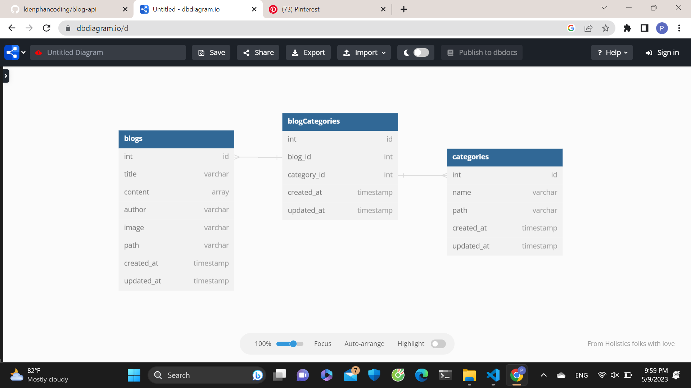

## Design Database cơ bản

Table blogs{
int id
title varchar
content array
author varchar
image varchar
path varchar
created_at timestamp
updated_at timestamp
}

Table blogCategories{
int id
blog_id int
category_id int
created_at timestamp
updated_at timestamp
}

Table categories{
int id
name varchar
path varchar
created_at timestamp
updated_at timestamp
}

Ref: "blogCategories"."blog_id" < "blogs"."int"

Ref: "blogCategories"."category_id" < "categories"."int"
